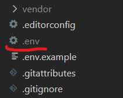
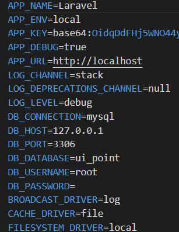

# The Meeting Point 
Se trata de un proyecto en equipo que realizamos en el Bootcamp de <a href="https://factoriaf5.org/">Factoria F5</a>. Trabajamos en una app llamada <a href="" style="color:#FFC700">The Meeting Point</a>. Esta proyecto se trata de una serie de Eventos del mundo de la informatica y desarrollo web al cual un Usuario se podria suscribir y desuscribirse en cualquier momento. El usuario para poder suscribirse a un evento debe de regitrarse con anterioridad o logearse en caso de que ya lo este.
 Ademas cuenta con un dashboard para el admin en el cual podemos crear nuevos eventos y editarlos en caso de error o cambios en cualquier tipo.
>Para todo esto usamos una base de datos local en la cual hay 2 columnas principales una de usuarios y otra de eventos en la cual se vinculan una con la otra a la hora de que un usuario se susvribe a un evento. A continuacion te mostraremos lo que contiene cada columna.

<h3>Usuario</h3>
<ul> 
    <li>Un Nombre de usuario: Para saber que persona es la que esta suscrita al evento.</li>
    <li>Un Email : Para que pueda recibir un mail con la confirmacion de que se ha suscrito.</li>
    <li>Un password : Para que al usar la contraseña en el login pase a ser un usuario autorizado</li>
    <li>Un tipo admin : Para saber si eres admin y poder tener acceso a las vistas del administrador.</li>
</ul>

<h3>Evento</h3>
<ul> 
    <li>Un titulo : Para saber de que es el evento.</li> 
    <li>Una descripcion : Para saber que tipo de contenido tiene ese evento.</li>
    <li>Una imagen : Una imagen representativa de ese evento.</li>
    <li>Una fecha : Para saber en que fecha empieza ese evento.</li>
    <li>Un contador de personas : Para saber la cantidad de personas estan suscritas y el limite de ese evento.</li>
    <li>Un id de usurio : seria el vinculo de estas 2 columnas principales.</li>
</ul>

Esta app cuenta con 6 vistas:

<ul> 
    <li>La Landing o Home : Esta vista la puede ver cualquier persona, pero para inscribirse en algun evento debe registrarse o logearse.</li> 
    <li>La My events : Esta vista muestra los eventos a los que te has suscrito y la pueden ver unicamente la gente que esta registrada.</li>
    <li>La Login : Esta vista la puede ver cualquier persona es para logearse si ya estas registrado</li>
    <li>La Register : Esta vista la puede ver cualquier persona es para registrarse</li>
    <li>La Create : Esta vista unicamente puede verla el admin es para crear mas evenetos</li>
    <li>La Edit : Esta vista unicamente puede verla el admin es para editar algun evento ya creado</li>
</ul>

Despues de toda esta explicacion vamos a ver que es lo que necesitamos para poder tener esta app. Let´s Gooooo!!!

<h2>Comenzamos 🚀</h2>

Para tener una copia de nuestro projecto debes de tener unos programas que a continuacion te vamos a mostar.

<h2>Pre-requisitos 📋</h2>

Necestitamos: <a href="https://code.visualstudio.com/">Visual Studio Code</a>(O cualquier otro editor de codigo), <a href="https://github.com/">GitHub</a> y <a href="https://www.apachefriends.org/es/index.html">XAMPP</a>(En caso de tener Windows), <a href="https://www.mamp.info/de/windows/">MAMPP</a>(En caso de tener Mac) o <a>LAMPP</a>(En caso de tener Linux). En Linux se podria Instalar XAMPP tambien(<a href="https://www.apachefriends.org/es/faq_linux.html">Info</a>).

Que es Visual Studio Code, GitHub y XAMPP/MAMPP/LAMPP???

<a>XAMPP</a>, <a>MAMPP</a>, <a>LAMPP</a> Son servidores independientes de software libre que consisten principalmente en la base de datos MySQL, el servidor web Apache y los intérpretes para lenguajes de script: PHP y Perl.

<a href="https://code.visualstudio.com/">Visual Studio Code</a> es un editor de código fuente. Es compatible con varios lenguajes de programación y un conjunto de características que pueden o no estar disponibles para un lenguaje dado.

<a href="https://github.com/">GitHub</a> es un repositorio online gratuito que permite gestionar proyectos y controlar versiones de código. Es muy utilizado por desarrolladores para almacenar sus trabajos dando así la oportunidad a millones de personas de todo el mundo a cooperar en ellos.

<h2>Instalación 🔧</h2>

Te dejaremos en la etiqueta tutoriales unos videos para poder descargar e instalar cada programa. Ademas de un video de como configurarlos para que esten vinculados.

<h2>Tutoriales 📌</h2>

Instalacion XAMPP: <a href="https://www.youtube.com/watch?v=MtllDrDm4cM">XAMPP</a>

Instalacion MAMPP: <a href="https://www.youtube.com/watch?v=fO9AheDZi30">MAMPP</a>

Instalacion LAMPP: <a href="https://www.youtube.com/watch?v=YoYb0pGKTD0&t=253s">LAMPP</a>

Instalacion de Visual Studio Code: <a href="https://www.youtube.com/watch?v=cO5n3vMLdjE">Visual Studio Code</a>

Instalacion de GitHub: <a href="https://www.youtube.com/watch?v=tn6tloweTUs">GitHub</a>

Vinculacion de ambos: <a href="https://www.youtube.com/watch?v=htstKtlFKeE">Vinculacion</a>
 
 
 

### Este proyecto esta producido en el framework <a style="color:#FA0C01" href="https://laravel.com/" >Laravel</a>. A continuacion te vamos a dejar unos comando que vas a necesitar.

## Comandos 📌

Una vez hecho el clon del codigo en la carpeta que tengas creada para este proyecto.

Abrir la carpeta que se creo al clonar con tu editor de codigo y en la terminal usar los siguientes comandos.

 

>composer i

 

Si no lo tienes vas a necesitar instalar global o localmente Composer(Link a la pagina <a style="color:#F5E800" href="https://getcomposer.org/download/">Composer</a>). Este comando te creara la carpeta vendor.
 
 

>npm i

 

Si no lo tienes vas a necesitar instalar global o localmente Nodejs(Link a la pagina <a style="color:#00F520" href="https://nodejs.org/es/">Nodejs</a>). Este comando te creara la carpeta nodemodules.

 
 

>composer require livewire/livewire

 

Este comando sirve para poder ver los componentes que estan a travez de <a style="color:#D758C1" href="https://laravel-livewire.com/">Livewire</a> (Link a la pagina de livewire/laravel)

 
 

>php artisan storage:link

 

Este comando sirve para tener un acceso directo a los archivos temporales. 

 

Antes de seguir con los comandos debemos crear un archivo que se llame ".env" tal cual se ve en l suiguien imagen. Este archivo va a ser el encargado de hacer la conexion con la base de datos.

Dentro de este archivo va a ir lo que contiene el archivo de texto conexionDB.txt. Una vez tengas copiado el texto que contiene en el ".env" vas a tener que haver los siguientes cambios:

 

En el apartado DB_PORT vas a tener que tener que poner el puerto que contenga tu servidor XAMP, MAMP o LAMP.

En el apartado DB_DATABASE vas a tener que poner el nombre del archivo que tengas en tu base de datos o en todo caso crear una base de datos con este nombre "ui_point". Les dejamos un video informativo a continuacion:

Crear base de datos y tablas:<a href="https://www.youtube.com/watch?v=xgltfvAkZaE">Base de datos</a>

En el apartado DB_PASSWORD si tienes Windows el password por defecto seria un string vacio y si tienes mac el password seria "root".

Una vez conectado con la base vamos a hacer la migracion de las factorias y seeders que contiene el proyecto a travez del siguiente comando:

 

>php artisan migrate:fresh --seed

 

Y por ultimo los 2 comandos para ver el proyecto en tu navegador:

 

>php artisan serve

 

Este comando te dara un servidor de desarrollo laravel donde vas a poder ir viendo tus cambios.

 

>npm run watch

 

Este comando te va a permitir ver tus cambios en lo que se refiere a estilos de css o bootstrap.

<h2>Construido con 🛠️</h2>
  
<ul>
  <li><a href="https://trello.com/">Trello</a> - Kanban o gestor de proyectos</li>
  
  <li><a style="color:#7500D6" href="https://www.figma.com/">Figma</a> - Programa para diseñar el proyecto (Wireframe y Mockup)</li>
  
  <li><a style="color:#0EF477" href="https://www.flaticon.com/">Flaticon</a> - Bancos de iconos</li>
  
  <li><a style="color:#0C41EA" href="https://code.visualstudio.com/">Visual Studio Code</a> - Editor de codigo</li>

  <li><a style="color:#F58602" href="https://www.apachefriends.org/es/index.html">XAMPP</a> - Servidor independiente de software libre</li>
  
  <li><a style="color:#2313F5" href="https://github.com/">GitHub</a> - Repositorio online</li>
</ul>

<h2>Autores ✒️</h2>

Integrantes y roles dentro del proyecto:

<ul>
  
  <li>Jaume Gomicia Intriago - Scrum Team - <a href="https://github.com Exodya21">Exodya21</a></li>

  <li>David Alcalde Iglesias - Scrum Team - <a href="https://github.com/Davaious">Davaious</a></li>

  <li>Felicia Folatimilehin - Scrum Team - <a href="https://github.com/timfel20">timfel20</a></li>
  
  <li>Facundo Ramallo - Scrum Team - <a href="https://github.com/FacuRamallo">Facu Ramallo</a></li>
  
  <li>Biplop Dey - Scrum Team - <a href="https://github.com/biplopdey">biplopdey</a></li>

  <li>Ariann Carvajal Menéndez - Scrum Master - <a href="https://github.com/thisisariann">thisisariann</a></li>
  
  <li>Lucas Martinez - Product Owner - <a href="https://github.com/LucasMartinez69">LucasMartinez69</a></li>

</ul>

<h2>Expresiones de Gratitud 🎁</h2>

<ul>
  
  <li>Comenta a otros sobre este proyecto y esperemos que te halla gustado nuestra manera de explicartelo 📢.</li>
  
  <li>Invita una cerveza 🍺 o un café ☕ a alguien del equipo.</li>
  
  <li>Dar las gracias a Factoria F5 por darnos la oportunidad de poder demostrar de lo que somos capaces ( ͡🔥 ͜ʖ ͡🔥).</li>
  
  <li>Agraddecer tambien a nuestros formadores <a href="https://github.com/Diego-on-c">Diego Cordoba</a>, <a href="https://github.com/Sergi-Virgili">Sergi Virgili Flor</a> y <a href="https://github.com/MAlexGG">Alexandra Galarza</a>
  por tener tanta paciencia y por brindarnos todo su conocimiento.</li>
  
  <li>Etc.</li>
  
</ul>

